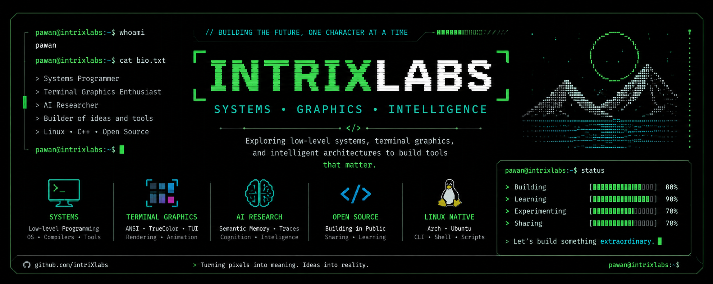
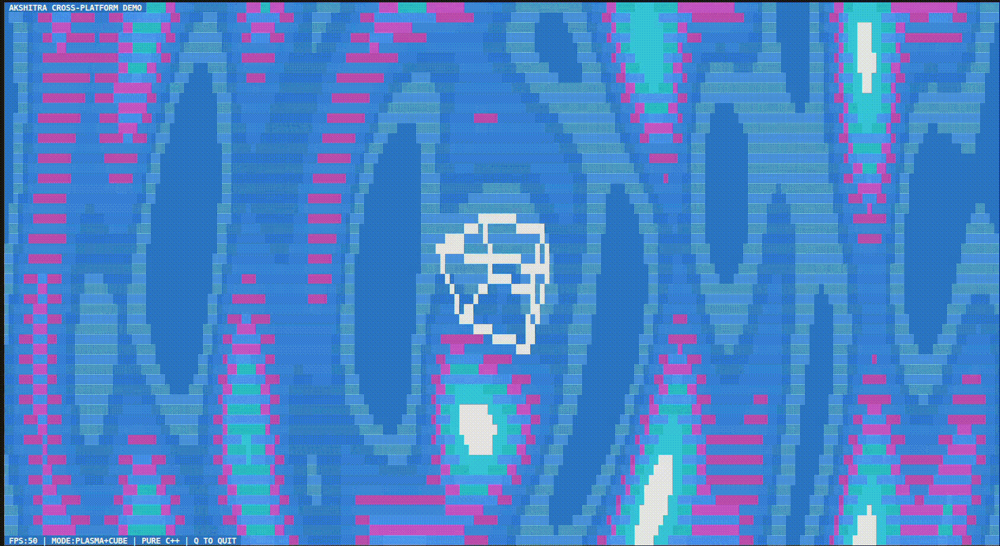

# AksChitra-Initiality


# 💫 About Me:
🔭 I’m currently working on:<br>🎨 AksChitra – A C++ terminal graphics engine<br>🧠 Trace Network – Experimental semantic memory architecture<br>⚡ IntrixLabs – Open-source systems and graphics projects<br><br>👯 I’m looking to collaborate on:<br>Low-level programming, rendering engines, terminal graphics,<br>semantic architectures and open-source system software.<br><br>🤝 I’m looking for help with:<br>Building an open-source community around AksChitra<br>and improving cross-terminal compatibility.<br><br>🌱 I’m currently learning:<br>Rendering Algorithms • OpenGL ES • Distributed Systems<br>AI Architectures • Operating Systems<br><br>💬 Ask me about:<br>C++, Linux, Terminal Graphics, ANSI Escape Codes,<br>Rendering, Low-level Programming or AI ideas.<br><br>⚡ Fun fact:<br>I like understanding software from pixels to ideas.


## 🌐 Socials:
[](https://www.instagram.com/Intrixlabs/) 
[](https://www.linkedin.com/in/intrinxlabs-a195393a2/) 
[](https://www.reddit.com/user/Technical_Chip5906/) 
[](https://www.youtube.com/@intrinXlabs) 
[](https://mastodon.social/@intrixlabs) 
[](mailto:intrixlabs@gmail.com) 

# 💻 Tech Stack:
             
# 📊 GitHub Stats:
<br/>
<br/>


```bash
$ philosophy

"Programming is my way of turning thoughts into consequences." - Pawan (INTRIXLABS)
